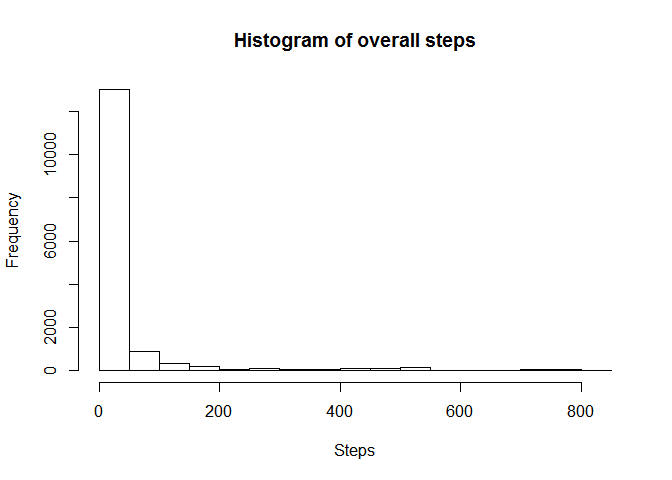
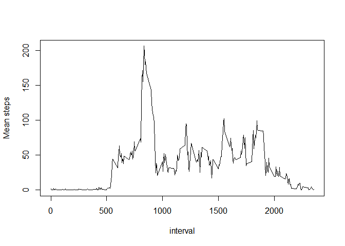
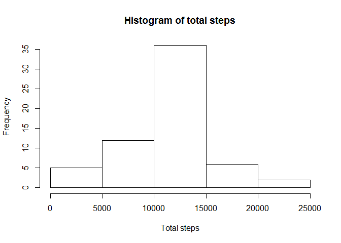
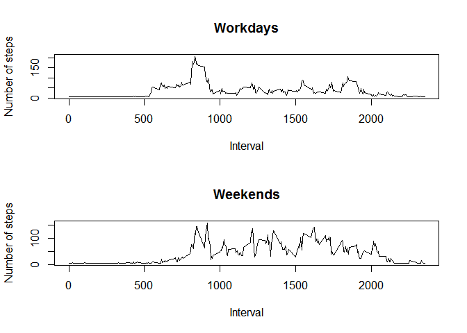

# Reproducible Research: Peer Assessment 1


Dplyr is used during the loading and preprocessing the data


## What is mean total number of steps taken per day?

Total steps per day

```
## Source: local data frame [61 x 2]
## 
##          date total
## 1  2012-10-01    NA
## 2  2012-10-02   126
## 3  2012-10-03 11352
## 4  2012-10-04 12116
## 5  2012-10-05 13294
## 6  2012-10-06 15420
## 7  2012-10-07 11015
## 8  2012-10-08    NA
## 9  2012-10-09 12811
## 10 2012-10-10  9900
## ..        ...   ...
```


 

Mean and median number of steps per day

```
## Source: local data frame [61 x 3]
## 
##          date     mean median
## 1  2012-10-01      NaN     NA
## 2  2012-10-02  0.43750      0
## 3  2012-10-03 39.41667      0
## 4  2012-10-04 42.06944      0
## 5  2012-10-05 46.15972      0
## 6  2012-10-06 53.54167      0
## 7  2012-10-07 38.24653      0
## 8  2012-10-08      NaN     NA
## 9  2012-10-09 44.48264      0
## 10 2012-10-10 34.37500      0
## ..        ...      ...    ...
```


## What is the average daily activity pattern?

The 5 minute interval with max nr of steps is 835  as seen in the time series plot below.
 


## Imputing missing values

Nr of missing values are 2304


 

Mean & median steps per day

```
## Source: local data frame [61 x 3]
## 
##          date     mean  median
## 1  2012-10-01 37.38260 37.3826
## 2  2012-10-02  0.43750  0.0000
## 3  2012-10-03 39.41667  0.0000
## 4  2012-10-04 42.06944  0.0000
## 5  2012-10-05 46.15972  0.0000
## 6  2012-10-06 53.54167  0.0000
## 7  2012-10-07 38.24653  0.0000
## 8  2012-10-08 37.38260 37.3826
## 9  2012-10-09 44.48264  0.0000
## 10 2012-10-10 34.37500  0.0000
## ..        ...      ...     ...
```

Does these numbers differ from the first part of the assignment? Yes.The imputation increased the proportion of low activity compared to the non-imputed values seen below.

```
## Source: local data frame [61 x 3]
## 
##          date     mean median
## 1  2012-10-01      NaN     NA
## 2  2012-10-02  0.43750      0
## 3  2012-10-03 39.41667      0
## 4  2012-10-04 42.06944      0
## 5  2012-10-05 46.15972      0
## 6  2012-10-06 53.54167      0
## 7  2012-10-07 38.24653      0
## 8  2012-10-08      NaN     NA
## 9  2012-10-09 44.48264      0
## 10 2012-10-10 34.37500      0
## ..        ...      ...    ...
```

## Are there differences in activity patterns between weekdays and weekends?


 
